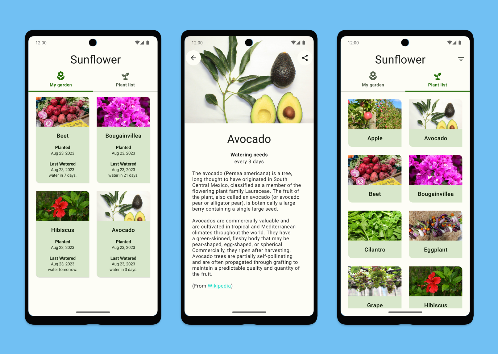

# Android Sunflower with Compose

A gardening app illustrating Android development best practices with migrating a View-based app to
Jetpack Compose. To learn about how Sunflower was migrated to Compose, see the 
[migration journey](https://github.com/android/sunflower/blob/main/docs/MigrationJourney.md) document.

**Note**: To see the original View implementation of Sunflower, checkout the [`views`](https://github.com/android/sunflower/tree/views) branch.

## Screenshots



## Features

This sample showcases how to migrate an existing View-based app (Material 2) to Compose (Material 3). 
See the linked migration journey doc above to learn more.

**Note**: As Compose cannot render HTML code in `Text` yet. The 
`AndroidViewBinding` API is used to embed a `TextView` in Compose. See the 
`PlantDescription` composable in the
[PlantDetailView file](app/src/main/java/com/google/samples/apps/sunflower/compose/plantdetail/PlantDetailView.kt).

## Requirements

### Unsplash API key

Sunflower uses the [Unsplash API](https://unsplash.com/developers) to load pictures on the gallery
screen. To use the API, you will need to obtain a free developer API key. See the
[Unsplash API Documentation](https://unsplash.com/documentation) for instructions.

Once you have the key, add this line to the `gradle.properties` file, either in your user home
directory (usually `~/.gradle/gradle.properties` on Linux and Mac) or in the project's root folder:

```
unsplash_access_key=<your Unsplash access key>
```

The app is still usable without an API key, though you won't be able to navigate to the gallery screen.

Android Studio IDE setup
------------------------
For development, the latest version of Android Studio is required. The latest version can be
downloaded from [here](https://developer.android.com/studio/).

Sunflower uses [ktlint](https://ktlint.github.io/) to enforce Kotlin coding styles.
Here's how to configure it for use with Android Studio (instructions adapted
from the ktlint [README](https://github.com/shyiko/ktlint/blob/master/README.md)):

- Close Android Studio if it's open

- Download ktlint using these [installation instructions](https://github.com/pinterest/ktlint/blob/master/README.md#installation)

- Apply ktlint settings to Android Studio using these [instructions](https://github.com/pinterest/ktlint/blob/master/README.md#-with-intellij-idea)

- Start Android Studio

Additional resources
--------------------
Check out these Wiki pages to learn more about Android Sunflower:

- [Notable Community Contributions](https://github.com/android/sunflower/wiki/Notable-Community-Contributions)

- [Publications](https://github.com/android/sunflower/wiki/Sunflower-Publications)

Non-Goals
---------
Previously, this sample app was focused on demonstrating best practices for
multiple Jetpack libraries. However, this is no longer the case and development
will instead be focused on how to adopt Compose in an existing View-based app.
So, there are no plans to implement features outside of this scope. Keep this
in mind when making contributions to this library.

Support
-------

- Stack Overflow:
  - https://stackoverflow.com/questions/tagged/android-jetpack-compose

If you've found an error in this sample, please file an issue:
https://github.com/android/sunflower/issues

Patches are encouraged, and may be submitted by forking this project and submitting a pull request
through GitHub.

Third Party Content
-------------------
Select text used for describing the plants (in `plants.json`) are used from Wikipedia via CC BY-SA 3.0 US (license in `ASSETS_LICENSE`).

"[seed](https://thenounproject.com/search/?q=seed&i=1585971)" by [Aisyah](https://thenounproject.com/aisyahalmasyira/) is licensed under [CC BY 3.0](https://creativecommons.org/licenses/by/3.0/us/legalcode)
