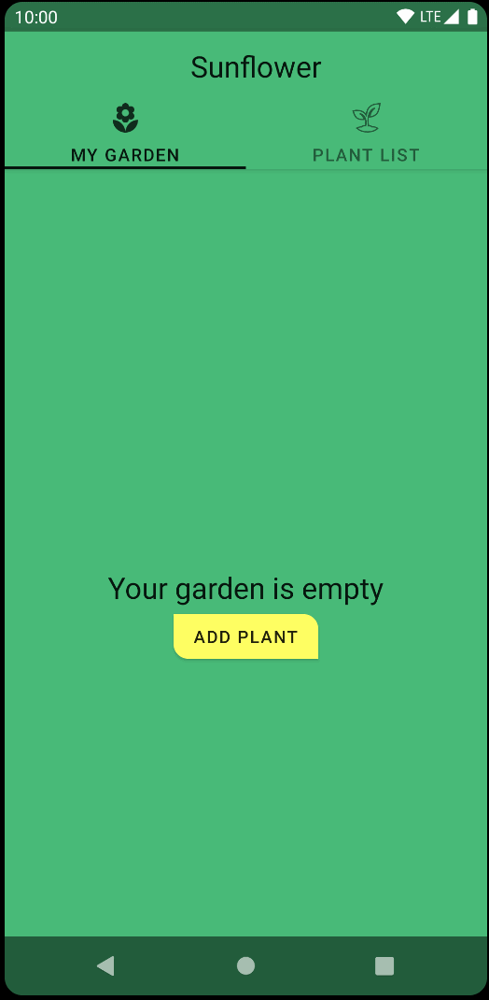

# Android Sunflower with Compose

For more information about Sunflower, check out the `main` branch
[README file](https://github.com/android/sunflower/blob/main/README.md).
This branch has Sunflower partially built with
[Jetpack Compose](https://developer.android.com/jetpack/compose).

This sample showcases:
* Compose working in an existing app: including integration with strings, resources, and themes and styles.
* Integration with an existing architecture based on Jetpack libraries.
* `CollapsingToolbarLayout` behavior implemented manually with Compose.
* Showing [Snackbars](https://material.io/components/snackbars) with Compose.
* Using Compose within a `RecyclerView` ([PR #763](https://github.com/android/sunflower/pull/763))

## Screenshots



## Features

Sunflower's [plant details screen](app/src/main/java/com/google/samples/apps/sunflower/PlantDetailFragment.kt)
is built with Compose as well as the [plant list item](app/src/main/java/com/google/samples/apps/sunflower/compose/plantlist/PlantListItemView.kt)
view within a `RecyclerView`.

All Compose code can be found in the `compose`
[folder](app/src/main/java/com/google/samples/apps/sunflower/compose).

**Note**: As Compose cannot render HTML code in `Text` yet. The 
`AndroidViewBinding` API is used to embed a `TextView` in Compose. See the 
`PlantDescription` composable in the
[PlantDetailView file](app/src/main/java/com/google/samples/apps/sunflower/compose/plantdetail/PlantDetailView.kt).

## Requirements

[Android Studio Chipmunk 2021.2.1](https://developer.android.com/studio) or newer.

## License

```
Copyright 2020 The Android Open Source Project

Licensed under the Apache License, Version 2.0 (the "License");
you may not use this file except in compliance with the License.
You may obtain a copy of the License at

    https://www.apache.org/licenses/LICENSE-2.0

Unless required by applicable law or agreed to in writing, software
distributed under the License is distributed on an "AS IS" BASIS,
WITHOUT WARRANTIES OR CONDITIONS OF ANY KIND, either express or implied.
See the License for the specific language governing permissions and
limitations under the License.
```
